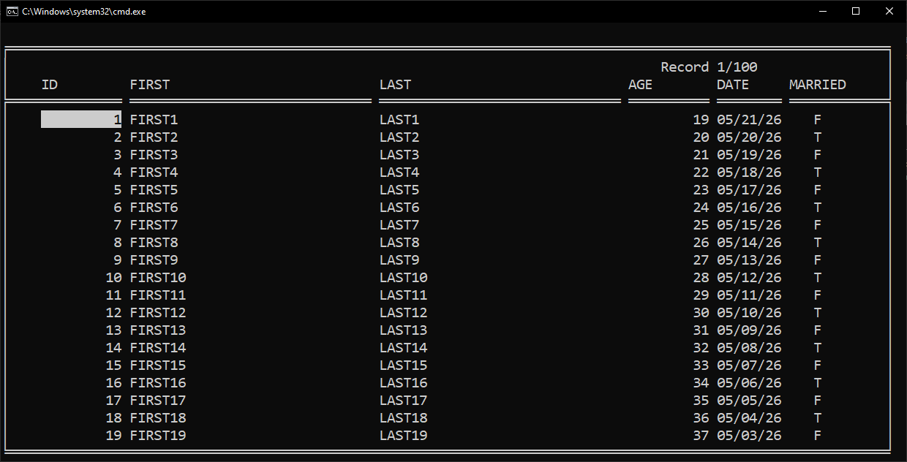

# How to use Firebird 5 embedded

Firebird 5 embedded can be a alternative for SQLite.

See the example below.

## Example

Download the file below and extract the files:

https://github.com/FirebirdSQL/firebird/releases/download/v5.0.4/Firebird-5.0.4.1812-0-windows-x64.zip

Create a folder for the application.

From the extracted files above, copy these folders and files to the application folder:

intl  
plugins  
fbclient.dll  
firebird.conf  
firebird.msg  
ib_util.dll  

Compile the test tests\firebird\firebird1b.prg.

Move the executable to the application folder:

intl  
plugins  
fbclient.dll  
firebird.conf  
firebird.msg  
**firebird1b.exe**  
ib_util.dll  

Run the executable from the command line:

firebird1b --dtd test.fdb

You should see the window below:

Open a issue if you have problems or start a discussion for more info:

https://github.com/marcosgambeta/sqlrddpp/issues

https://github.com/marcosgambeta/sqlrddpp/discussions
